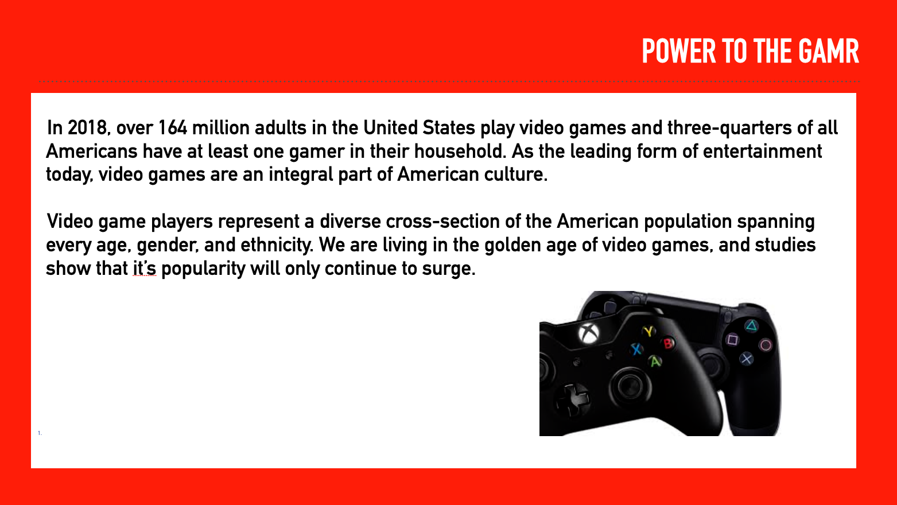
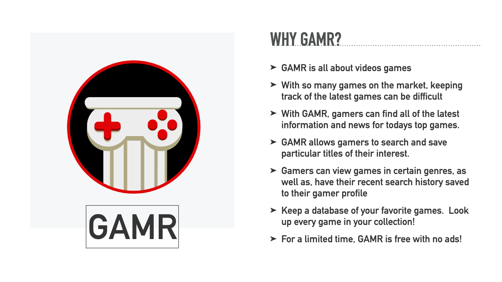
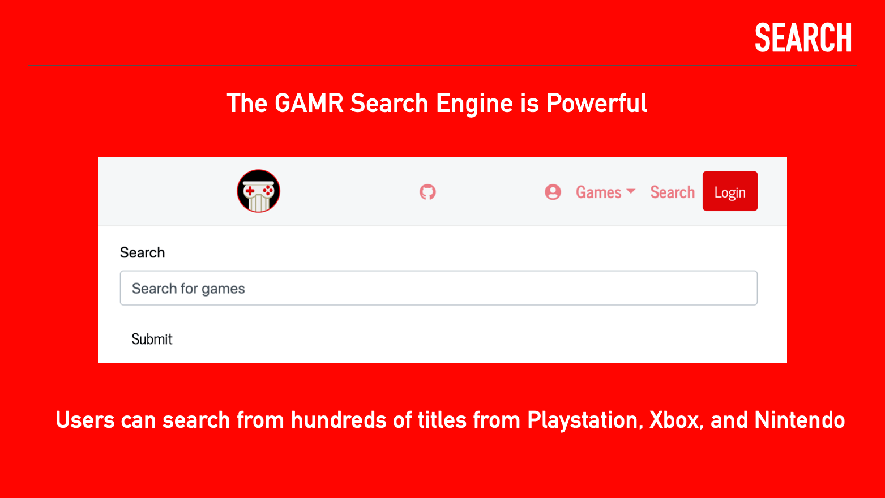
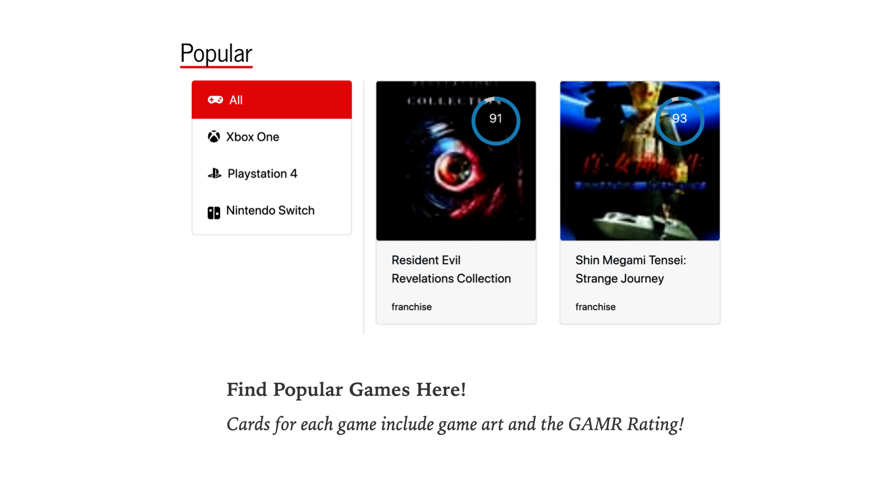

# GAMR-database-react-app

Gamer database application made with React.

* READ ME
* Project #3
* GAMR
* Version: 1.0.0
* Web Design By Josh Fiason, Clint Gordy, Travis John, Tripp Parham
* Published: Wednesday April 25th 2020

## About GAMR

* Get all of your game data from GAMR. Find popular games, gaming news, recent releases, upcoming releases, as well as most anticipated games

# Screenshots

## Configuration instructions

* No configuration necessory
* Visit the following link to experience GAMR

## https://GAMR-react-application.herokuapp.com

## Installation instructions

* GAMR works on most main stream browsers using the link above.

## Operating instructions
* New users are able to register or login on the home page
* Once logged in, the user is presented buttons to select Popular games for Xbox One, Playstation 4, and Nintendo Switch.
* Next in the News section users will be able to view recent gaming news.
* List of upcoming, most anticipated, and newly released games are at the bottom of the homepage.
* Clicking game title takes the user to the game page for each individual game.
* GAMR allows gamers to search and save particular titles of their interest.
* Gamers can view games in certain genres, as well as have their recent search history saved to their gamer profile

## List of files included in the following structure

* Client
    * package-lock.json
    * package.json
    * README.md
    * public
        * images
            * gamer.png
            * masthead-desktop.jpg
            * masthead-mobile.jpg
            * psds
                * masthead-desktop.psd
                * masthead-mobile.psd
        * index.html
        * manifest.json
    * src
        * index.js
        * Compontents
            * AdvancedSearch.js
            * Footer.js
            * GameDetails.js
            * GameList.js
            * Login.js
            * MainNav.js
            * Masthead.js
            * News.js
            * Popular.js
            * Register.js
            * Screenshots.js
            * SerchForm.js
            * SerchResult.js
            * SearchResult.js
            * Upcoming.js
            * User.js
            * UserProfile.js
        * css
            * bootstrap.css
            * bootstrap.min.css
        * pages
            * Games.js
            * Home.js
            * LoginPage.js
            * Profile.js
            * Register.js
            * Search.js
            * SearchResults.js
        * scss files
        * svg
            * gallery-bg.svg
            * gamer.svg
            * logo.svg
            * nintendo-switch.svg
        * utils
            * api.js
                ProgressProvider.js
* models
    * Game
        * cover.js
        * game.js
        * platform.js
        * platformlogo.js
        * releasedate.js
        * screenshot.js
    * Genre
        * genre.js
    * index.js
    * User
        * user.js
    * user.js (Is this a duplicate file?)
* routes
    * api.js
    * controller.js
* server.js

## Copyright and licensing information

None

## Contact information for the distributor or programmer

* Site Developers: 
    * Tripp Parham Email: tripp.parham@me.com
    * Josh Faison
    * Clint Gordy
    * Travis John

## Known bugs[0]

* Yes, there are bugs.  This project is still in development.

## Tests[8]

* All API calls work in Postman
* New users are able to register or login on the home page correctly
* Once logged in, the user is correctly presented buttons to select Popular games for Xbox One, Playstation 4, and Nintendo Switch.
* Next in the News section users are be able to view recent gaming news.
* List of upcoming, most anticipated, and newly released games are presenting correctly at the bottom of the homepage.
* Clicking game title takes the user to the game page for each individual game correctly unless API key is expired.
* Search and save particular titles works correctly.
* Gamers can correctly view games in certain genres, as well as have their recent search history saved to their gamer profile

## Credits and acknowledgments

Special thanks to the Instructors and TA's at the UNC Coding Bootcamp. They are an awesome team!  Thank you for all of your instruction!

## Change Log

## Site Updates

* Version 1.0.0 Released Saturday April 25th, 2020
